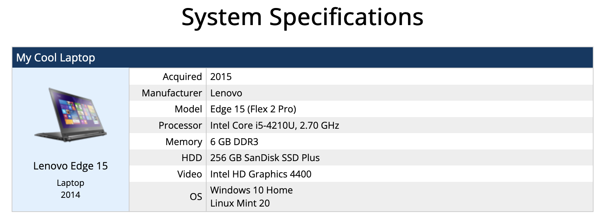

# System Specs Page



I created this site to share the specs of my computer collection. Due to demand, I have chosen
to open source it.

This is a simple Jekyll website that uses a series of YAML files to compile a list of computers and their specs. There's not much to it.

[Live demo](https://www.brandondusseau.com/sys/)

## Prerequisites

To build this site, you'll need to install Ruby and Jekyll
([instructions](https://jekyllrb.com/docs/installation/)).

This guide also assumes that you are at least somewhat familiar with the command line.

## Setup

First, [download the latest release](https://github.com/BrandonDusseau/system-specs/releases/latest) from the releases page. Then, follow the
instructions in the _Adding Computers_ section below to set up your computers.

To build the site, navigate to this directory in your terminal and run `jekyll build`. Upload the contents of the `public` folder to your web server. Easy!

## Adding Computers

Each computer is represented by a Markdown (.md) file in the `_site/_computers` directory. Jekyll will automatically parse these files to generate the final page. The filename of these files doesn't have any impact on the built site.

Here's a sample. Note that the properties of the computer are preceded and followed by `---`. This is important, because it tells Jekyll where it can find the metadata that describes this machine. For more info, see [their docs on front matter](https://jekyllrb.com/docs/front-matter/).

```yaml
---
name: "My Cool Laptop"
thumb: "edge15.png"
type: "Laptop"
released: 2014
acquired: 2015
mfg: "Lenovo"
short_model: "Edge 15"
model: "Edge 15 (Flex 2 Pro)"
cpu: "Intel Core i5-4210U, 2.70 GHz"
mem: "6 GB DDR3"
hdd: "256 GB SanDisk SSD Plus"
video: "Intel HD Graphics 4400"
os:
  - "Windows 10 Home"
  - "Linux Mint 20"
---
```

The following properties are supported at this time:

* `name`: The name of the computer. This is displayed at the top of the entry and also used to generate the anchor on the page.

* `custom`: If set to `true` the computer will be represented as a custom build which changes what properties are displayed (see below). It is ignored otherwise.

* `disposed`: If set to `true` the computer will be displayed in the "Past Systems" section of the page instead of the main list. It is ignored otherwise.

* `thumb`: The filename of the thumbnail to display. This should be a 100x100 PNG file located in `_site/thumbnails`.

* `type`: The type of computer displayed in the sidebar. I usually use "Desktop" or "Laptop".

* `released`: The year the computer was released, displayed in the sidebar. This will be ignored and replaced by `acquired` for custom builds.

* `acquired`: The year the computer was purchased or built.

* `mfg`: The manufacturer of the computer. Ignored for custom builds.

* `short_mfg`: The manufacturer name displayed on the sidebar. If omitted, `mfg` will be displayed instead. Ignored for custom builds.

* `model`: The full model name of the computer. Ignored for custom builds.

* `short_model`: The model name displayed on the sidebar. If omitted, `model` will be displayed instead. Ignored for custom builds.

* `case`: The case/chassis of the computer. Displayed only for custom builds.

* `mb`: The motherboard of the computer. Displayed only for custom builds.

* `cpu`: The CPU of the computer. Only one is supported at this time.

* `mem`: The RAM spec of the computer.

* `hdd`: The disk(s) in the computer, if any. This can either be a string or a YAML array of strings.

* `optical`: The optical drive(s) in the computer, if any. This can either be a string or a YAML array of strings.

* `video`: The video card(s) in the computer, if any. This can either be a string or a YAML array of strings.

* `os`: The operating system(s) installed on the computer. This can either be a string or a YAML array of strings.
